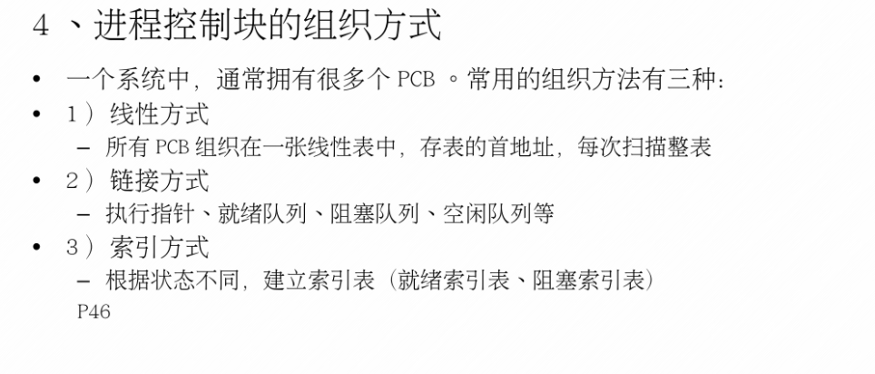

## **第三节课**

#### **1.进程的组成**

**进程是一个结构体     {程序， 数据，PCB（进程控制块）}**

#### 2.资源管理

#### 3.进程控制：

##### 进程的创建

##### 进程的终止

**终止的原因**：

##### 进程的阻塞

##### 进程的唤醒

##### 进程的销毁

#### 进程的同步和互斥

##### 同步

##### 互斥

**信号量机制解决上面的**